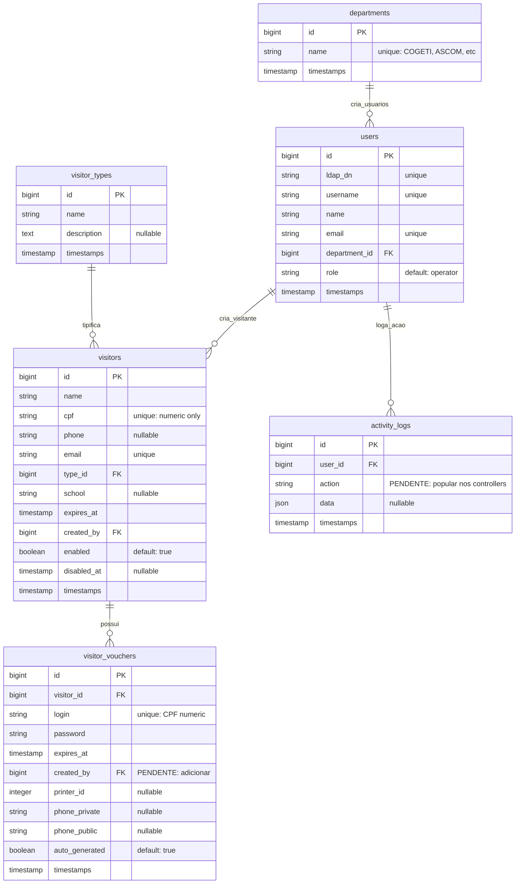

# SSD - System Specification Document

## 1. Visão Geral do Sistema

### 1.1 Descrição
Sistema de Gerenciamento de Visitantes com vouchers temporários para acesso à rede corporativa. O sistema cria usuários no Samba/AD via SSH e os remove automaticamente após expiração.

### 1.2 Tecnologias
- **Backend**: Laravel 12 + Inertia
- **Frontend**: React (via Inertia)
- **BD**: MySQL/PostgreSQL (configurável)
- **Autenticação**: LDAP/Active Directory
- **Infraestrutura**: SSH + Samba Tool

---

## 2. Arquitetura do Sistema

### 2.1 Diagrama de Arquitetura

```
┌─────────────────┐      ┌─────────────────┐      ┌─────────────────┐
│   Frontend      │      │   Laravel      │      │   BD MySQL      │
│   (React)       │ ←→   │   API          │ ←→   │                │
└─────────────────┘      └─────────────────┘      └─────────────────┘
                                  ↓
                         ┌─────────────────┐
                         │  SSH + Samba    │
                         │  (phpseclib3)  │
                         └─────────────────┘
                                  ↓
                         ┌─────────────────┐
                         │   AD/DC         │
                         │  (Samba4)      │
                         └─────────────────┘
```

### 2.2 Componentes Principais

| Componente | Responsabilidade |
|-----------|-----------------|
| `LdapService` | Conexão/auth LDAP, mapeamento grupo→department |
| `SambaService` | SSH para criar/deletar usuários no Samba |
| `VisitorsController` | CRUD visitantes + vouchers |
| `VouchersController` | Listagem vouchers |
| `DisableExpiredVisitors` | Comando cron para expirar visitantes |

---

## 3. Especificação de Banco de Dados

### 3.1 ER Diagram



### 3.2 Tabelas e Campos

| Tabela | Campo | Tipo | Descrição |
|--------|-------|------|-----------|
| `departments` | id | bigint | PK |
| | name | string | Nome único (COGETI, ASCOM, etc) |
| `users` | id | bigint | PK |
| | ldap_dn | string | DN do AD |
| | username | string | username do AD |
| | name | string | Nome completo |
| | email | string | Email institucional |
| | department_id | bigint | FK → departments |
| | role | string | admin/operator |
| `visitor_types` | id | bigint | PK |
| | name | string | Tipo de visitante |
| | description | text | Descrição |
| `visitors` | id | bigint | PK |
| | name | string | Nome do visitante |
| | cpf | string | CPF (só números) |
| | email | string | Email |
| | type_id | bigint | FK → visitor_types |
| | expires_at | timestamp | Data de expiração |
| | created_by | bigint | FK → users (quem criou) |
| | enabled | boolean | Ativo/inativo |
| `visitor_vouchers` | id | bigint | PK |
| | visitor_id | bigint | FK → visitors |
| | login | string | Login (CPF números) |
| | password | string | Senha |
| | expires_at | timestamp | Data de expiração |
| `activity_logs` | id | bigint | PK |
| | user_id | bigint | FK → users |
| | action | string | Ação realizada |
| | data | json | Dados antigos/novos |

---

## 4. Especificação de Autenticação LDAP

### 4.1 Fluxo de Login

```
1. Usuário acessa /login
2. Fornece username + password (não email)
3. LdapService.authenticate(username, password)
   ├── Conecta no AD
   ├── Busca usuário pelo sAMAccountName
   ├── Extrai grupos (memberOf)
4. Mapeia department pelos grupos CN
5. Mapeia role: COGETI → admin, outros → operator
6. Cria/atualiza usuário na tabela users
7. Loga no sistema
```

### 4.2 Variáveis de Ambiente

| Variável | Descrição | Exemplo |
|----------|----------|---------|
| LDAP_HOST | Host do AD | ldap://ldap.utfpr.edu.br |
| LDAP_PORT | Porta (389) | 389 |
| LDAP_BASE_DN | Base DN | dc=utfpr,dc=edu,dc=br |
| LDAP_DOMAIN | Domínio | utfpr.edu.br |
| LDAP_ADMIN_GROUP | Grupo admin | COGETI |

---

## 5. Especificação de SSH/Samba

### 5.1 Conexão SSH

- **Biblioteca**: phpseclib3
- **Autenticação**: Chave privada RSA
- **Host**: Configurável em `config/app.php`

### 5.2 Comandos SSH

| Comando | Descrição |
|---------|-----------|
| `samba-tool user create <user> <pass>` | Criar usuário |
| `samba-tool user setpassword <user> --newpassword=<pass>` | Alterar senha |
| `samba-tool user delete <user>` | Deletar usuário |

### 5.3 Configurações

```php
// config/app.php
return [
    'ip_smb' => env('IP_SMB'),
    'port_smb' => env('PORT_SMB', 22),
    'user_smb' => env('USER_SMB'),
    'path_ssh_smb' => env('PATH_SSH_SMB'),
];
```

---

## 6. Especificação de Cron Job

### 6.1 Comando de Expiração

```bash
php artisan visitors:disable-expired
```

Executa **diariamente às 00:00**:

1. Busca visitantes com `expires_at <= now()`
2. Para cada visitante:
   - Extrai CPF numérico → login
   - Executa `samba-tool user delete <login>`
   - Remove voucher da tabela
   - Log no Laravel

---

## 7. APIs e Endpoints

### 7.1 Rotas Web

| Método | Rota | Controller | Nome |
|--------|------|------------|------|
| GET | / | - | home |
| GET | /login | Fortify | login |
| POST | /logout | Fortify | logout |
| GET | /dashboard | Closure | dashboard |
| GET | /users | UsersController | users.index |
| PUT | /users/{user} | UsersController | users.update |
| GET | /departments | DepartmentsController | departments.index |
| POST | /departments | DepartmentsController | departments.store |
| GET | /visitorTypes | VisitorTypeController | visitorTypes.index |
| GET | /visitors | VisitorsController | visitors.index |
| POST | /visitors | VisitorsController | visitors.store |
| GET | /visitors/create | VisitorsController | visitors.create |
| GET | /visitors/{visitor}/edit | VisitorsController | visitors.edit |
| PUT | /visitors/{visitor} | VisitorsController | visitors.update |
| DELETE | /visitors/{visitor} | VisitorsController | visitors.destroy |
| POST | /visitors/{visitor}/generate-password | VisitorsController | visitors.generate-password |
| POST | /visitors/{visitor}/resend-password | VisitorsController | visitors.resend-password |
| GET | /vouchers | VouchersController | vouchers.index |

### 7.2 Middlewares

| Rota | Middleware |
|------|-------------|
| /dashboard | auth, verified |
| /users/* | auth, admin |
| /departments/* | auth, admin |
| /visitorTypes/* | auth, admin |
| /visitors/* | auth, verified |
| /vouchers/* | auth, verified |

---

## 8. Especificação de autorização

### 8.1 Papéis (Roles)

| Role | Descrição |
|------|-----------|
| `admin` | Acesso total (grupo COGETI no AD) |
| `operator` | Acesso restrito ao seu departamento |

### 8.2 Filtros por Departamento

- **COGETI (id=1)**: Vê todos os departamentos
- **Outros departamentos**: Vê apenas dados do seu department_id

---

## 9. Pendências e Melhorias

### 9.1 Pendências Atuais

| # | Pendência | Prioridade | Status |
|---|----------|-----------|--------|
| 1 | Adicionar `created_by` em visitor_vouchers | Alta | Pendente |
| 2 | Popular activity_logs nos controllers | Alta | Pendente |
| 3 | Dashboard com métricas | Alta | Pendente |
| 4 | Enviar email com link de redefinição | Média | Pendente |
| 5 | Notificações de vouchers prestes a expirar | Média | Pendente |
| 6 | Relatórios (PDF/Excel) | Baixa | Pendente |

### 9.2 Melhorias Futuras

- [ ] Auditoria completa de ações
- [ ] Sistema de notificações
- [ ] API REST para integrações
- [ ] Mobile app

---

## 10. Variáveis de Ambiente Necessárias

```env
# App
APP_URL=http://localhost
APP_KEY=base64:...

# Database
DB_CONNECTION=mysql
DB_HOST=localhost
DB_PORT=3306
DB_DATABASE=net_gp
DB_USERNAME=root
DB_PASSWORD=

# LDAP
LDAP_HOST=ldap://ldap.utfpr.edu.br
LDAP_PORT=389
LDAP_BASE_DN=dc=utfpr,dc=edu,dc=br
LDAP_DOMAIN=utfpr.edu.br
LDAP_EMAIL_DOMAIN=utfpr.edu.br
LDAP_ADMIN_GROUP=COGETI

# SSH/Samba
IP_SMB=10.x.x.x
PORT_SMB=22
USER_SMB=admin_smb
PATH_SSH_SMB=/path/to/private_key
```

---

## 11. Glossário

| Termo | Definição |
|-------|-----------|
| LDAP | Lightweight Directory Access Protocol |
| AD | Active Directory |
| Voucher | Credenciais de acesso temporárias |
| CPF | Cadastro de Pessoas Físicas |
| DN | Distinguished Name |
| CN | Common Name |
| OU | Organizational Unit |
| samba-tool | Ferramenta CLI do Samba4 |

---

*Documento criado em: 2026-04-29*
*Versão: 1.0*