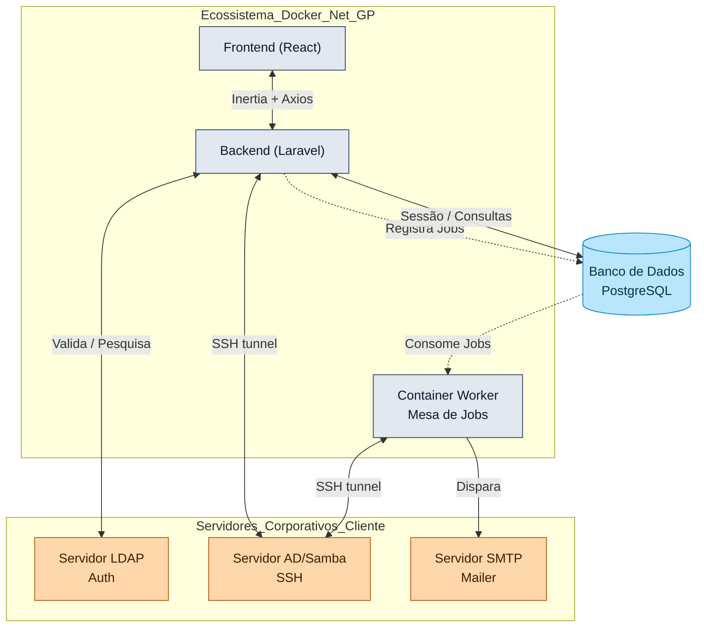
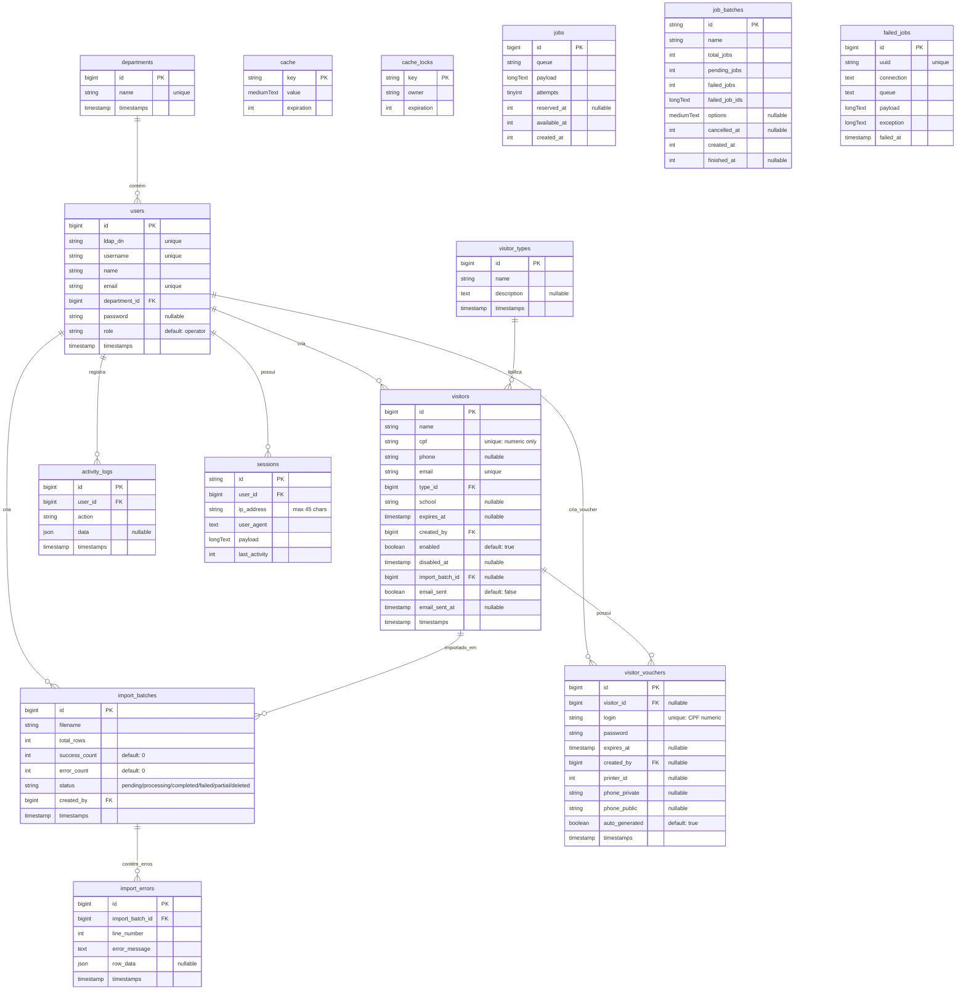

# SSD - System Specification Document

## 1. Visão Geral do Sistema

### 1.1 Descrição
Sistema de Gerenciamento de Visitantes com vouchers temporários para acesso à rede corporativa. O sistema cria usuários no Samba/AD via SSH e os remove automaticamente após expiração.

### 1.2 Tecnologias

| Tecnologia | Versão | Descrição |
|------------|--------|-----------|
| PHP | 8.2+ | Linguagem backend base |
| Laravel | 12.x | Backend Framework |
| Laravel Starterkit | - | Scaffold oficial englobando o pacote Inertia + React |
| React | 18.x | Framework frontend |
| Vite | 6.x | Build tool frontend rápido |
| Tailwind CSS | 3.x | Framework para estilização (CSS) |
| PostgreSQL | 14.x+ | Banco de dados primário |
| Docker | Latest | Isolamento das aplicações em múltiplos containeres |
| phpseclib3 | 3.x | Biblioteca de túnel SSH |
| PhpSpreadsheet | 2.x | Leitura/conversão massiva de planilhas XLSX/XLS |
| LDAP | - | Protocolo de pesquisa e autenticação do Active Directory |

---

## 2. Arquitetura do Sistema

### 2.1 Diagrama de Arquitetura



### 2.2 Componentes

Listagem completa de todos os componentes do sistema Net-GP:

#### 2.2.1 Frontend

| Componente | Tecnologia | Responsabilidade |
|-----------|-----------|-----------------|
| `React App` | React 18.x | Interface de usuário (SPA) |
| `Inertia Pages` | Inertia 2.x | Páginas roteadas pelo Laravel |
| `Tailwind Components` | Tailwind 3.x | Componentes visuais reutilizáveis |
| `Vite Config` | Vite 6.x | Build tool e hot-reload |

#### 2.2.2 Backend (Controllers)

| Componente | Responsabilidade |
|-----------|-----------------|
| `VisitorsController` | CRUD de visitantes (listar, criar, editar, excluir, gerar senha, reenviar) |
| `VouchersController` | Listagem e filtragem de vouchers |
| `UsersController` | Gestão de usuários do sistema (listar, editar roles) |
| `DepartmentsController` | CRUD de departamentos |
| `VisitorTypeController` | CRUD de tipos de visitante |
| `VisitorImportController` | Upload e processamento de importação em lote |
| `ImportBatchController` | Visualização e gestão de lotes importados |
| `DashboardController` | Métricas e cards do dashboard |

#### 2.2.3 Services

| Componente | Responsabilidade |
|-----------|-----------------|
| `LdapService` | Conexão, autenticação e pesquisa no Active Directory |
| `SambaService` | SSH via phpseclib3 para criar/deletar usuários no Samba/AD |
| `ActivityLogService` | Registro transversal de ações (IP, user agent, autor) |
| `VoucherService` | Geração de credenciais (login=CPF, senha automática) |
| `EmailService` | Disparo de emails com credenciais aos visitantes |

#### 2.2.4 Jobs e Commands

| Componente | Responsabilidade |
|-----------|-----------------|
| `DisableExpiredVisitors` | Comando cron que remove visitantes expirados do Samba e BD |
| `ProcessVisitorImport` | Job de fila que processa cada linha de importação em lote |
| `SendVoucherEmail` | Job de fila que dispara email de credenciais com rate limiting |

#### 2.2.5 Middlewares

| Componente | Responsabilidade |
|-----------|-----------------|
| `auth` | Verifica sessão autenticada |
| `verified` | Verifica se usuário tem departamento e role mapeados |
| `admin` | Restringe acesso a usuários com role=admin (COGETI) |

#### 2.2.6 Models

| Componente | Responsabilidade |
|-----------|-----------------|
| `User` | Usuário do sistema (sincronizado com LDAP) |
| `Department` | Departamento/setor |
| `Visitor` | Visitante cadastrado |
| `VisitorType` | Categoria de visitante |
| `VisitorVoucher` | Credencial temporária |
| `ActivityLog` | Registro de auditoria |
| `ImportBatch` | Lote de importação em massa |
| `ImportError` | Erros individuais de importação |

#### 2.2.7 Infraestrutura

| Componente | Responsabilidade |
|-----------|-----------------|
| `PostgreSQL` | Banco de dados relacional |
| `phpseclib3` | Biblioteca SSH para túnel seguro |
| `PhpSpreadsheet` | Leitura de planilhas XLSX/XLS |
| `Laravel Queue` | Sistema de filas (database driver) |
| `Laravel Scheduler` | Cron jobs do Laravel |
| `Docker` | Containerização dos serviços |

#### 2.2.8 Servidores Externos

| Componente | Responsabilidade |
|-----------|-----------------|
| `Servidor LDAP/AD` | Autenticação e mapeamento de grupos |
| `Servidor Samba/AD` | Gestão de usuários de rede via SSH |
| `Servidor SMTP` | Disparo de emails |

---

### 2.3 Componentes Principais

Explicação detalhada dos componentes core do sistema:

#### LdapService

Responsável por toda a comunicação com o Active Directory via protocolo LDAP. Realiza a autenticação dos usuários internos (operadores e admins) validando credenciais `username` + `password` contra o AD. Após autenticação bem-sucedida, extrai os grupos do usuário (`memberOf`), mapeia o grupo para um departamento do sistema e define a role: membros do grupo **COGETI** recebem `admin`, demais recebem `operator`. Cria ou atualiza o registro na tabela `users` automaticamente no primeiro login.

#### SambaService

Componente que estabelece conexão SSH segura com o servidor Samba/Active Directory utilizando a biblioteca `phpseclib3` com autenticação por chave privada RSA. Executa comandos remotos de gestão de usuários de rede:

- `samba-tool user create <user> <pass>` — criação de usuário temporário
- `samba-tool user setpassword <user> --newpassword=<pass>` — alteração de senha
- `samba-tool user delete <user>` — remoção de usuário

Utilizado na criação de visitantes, geração de novas senhas, reenvio de credenciais e na rotina de expiração automática. Cada operação é executada dentro de uma transação isolada para garantir atomicidade.

#### VisitorsController

Controller central do sistema, responsável pelo ciclo de vida completo dos visitantes. Implementa as operações de:

- **Listagem**: com paginação (10-15 registros), filtros por departamento, busca por nome/CPF/email
- **Criação**: valida CPF único, email único, cria Visitor + Voucher + usuário Samba + envia email + registra ActivityLog
- **Edição**: altera dados do visitante com validações de integridade
- **Exclusão**: remove visitante, voucher e usuário Samba (se voucher ativo)
- **Geração de senha**: cria nova senha de 8 caracteres e atualiza no Samba
- **Reenvio**: reenvia email com credenciais existentes

Aplica filtro departamental: operadores veem apenas visitantes que criaram; admins veem todos.

#### VouchersController

Controller dedicado à listagem e visualização de vouchers. Permite filtrar por departamento, tipo de visitante e criador. Ordena vouchers por proximidade de expiração e exibe indicador visual para vouchers expirados. Operadores veem apenas vouchers dos visitantes que criaram.

#### DisableExpiredVisitors (Cron Command)

Comando agendado executado diariamente às 00:00 pelo Laravel Scheduler. Executa a rotina de limpeza de visitantes expirados:

1. Query por visitantes com `expires_at <= now()` que possuem voucher ativo
2. Para cada resultado, abre uma transação isolada no banco
3. Deleta o usuário no Samba via SSH (`samba-tool user delete`)
4. Remove o voucher do banco de dados
5. Registra evento `visitor_expired` no ActivityLog
6. Commit da transação

Em caso de falha (timeout, erro de conexão), executa rollback apenas daquele visitante, registra o erro e continua para o próximo, garantindo que um voucher problemático não bloqueie toda a rotina.

#### ProcessVisitorImport (Queue Job)

Job processado em background pelo container Worker. Responsável por processar individualmente cada linha de uma planilha importada:

- Valida CPF matematicamente (dígitos verificadores)
- Verifica unicidade de CPF e email
- Cria Visitor + Voucher + usuário Samba
- Dispara email com delay de 2 segundos (rate limiting)
- Registra sucesso ou erro (com número da linha e mensagem)

#### ActivityLogService

Serviço transversal que registra todas as ações do sistema para fins de auditoria e rastreabilidade. Captura automaticamente:

- **Autor**: nome, email, role e departamento do usuário logado
- **Origem**: IP de origem e User Agent (navegador/SO)
- **Timestamp**: data/hora oficial da ação (`created_at`)
- **Evento**: tipo de ação (criação, edição, deleção, login, expiração, etc.)

Registrado em todas as operações de visitantes, autenticação, departamentos, tipos de visitante e importações.

#### DashboardController

Controller que agrega métricas para exibição no painel principal. Retorna dados para os cards e gráficos:

- Total de visitantes (geral e mensal)
- Total de visitantes expirados
- Vouchers ativos
- Distribuição de visitantes por departamento
- Evolução mensal de visitantes
- Próximos vouchers a expirar
- Últimas atividades (timeline dos 5 últimos logs)
- Histórico de lotes de importação

Aplica filtro departamental: operadores veem apenas métricas dos seus visitantes.

---

## 3. Especificação de Banco de Dados

### 3.1 ER Diagram



### 3.2 Tabelas e Campos

#### 3.2.1 Tabelas de Domínio

##### `departments`

Departamentos/setores da organização.

| Campo | Tipo | Restrição | Descrição |
|-------|------|-----------|-----------|
| id | bigint | PK | Identificador único |
| name | string | UNIQUE | Nome do departamento (COGETI, ASCOM, etc) |
| created_at | timestamp | | Data de criação |
| updated_at | timestamp | | Data de atualização |

##### `users`

Usuários internos do sistema (sincronizados via LDAP).

| Campo | Tipo | Restrição | Descrição |
|-------|------|-----------|-----------|
| id | bigint | PK | Identificador único |
| ldap_dn | string | UNIQUE | Distinguished Name do AD |
| username | string | UNIQUE | Username do AD (sAMAccountName) |
| name | string | | Nome completo |
| email | string | UNIQUE | Email institucional |
| department_id | bigint | FK → departments | Departamento do usuário |
| password | string | NULLABLE | Senha (nullable, auth via LDAP) |
| role | string | DEFAULT 'operator' | Perfil: admin ou operator |
| created_at | timestamp | | Data de criação |
| updated_at | timestamp | | Data de atualização |

##### `visitor_types`

Categorias de visitantes (aluno, fornecedor, palestrante, etc).

| Campo | Tipo | Restrição | Descrição |
|-------|------|-----------|-----------|
| id | bigint | PK | Identificador único |
| name | string | | Nome do tipo |
| description | text | NULLABLE | Descrição do tipo |
| created_at | timestamp | | Data de criação |
| updated_at | timestamp | | Data de atualização |

##### `visitors`

Visitantes cadastrados no sistema.

| Campo | Tipo | Restrição | Descrição |
|-------|------|-----------|-----------|
| id | bigint | PK | Identificador único |
| name | string | | Nome do visitante |
| cpf | string | UNIQUE | CPF numérico |
| phone | string | NULLABLE | Telefone |
| email | string | UNIQUE | Email do visitante |
| type_id | bigint | FK → visitor_types | Tipo do visitante |
| school | string | NULLABLE | Escola/Instituição |
| expires_at | timestamp | NULLABLE | Data de expiração do acesso |
| created_by | bigint | FK → users | Usuário que criou o visitante |
| enabled | boolean | DEFAULT true | Visitante ativo |
| disabled_at | timestamp | NULLABLE | Data de desativação |
| import_batch_id | bigint | FK → import_batches, NULLABLE | Lote de importação (se aplicável) |
| email_sent | boolean | DEFAULT false | Credenciais enviadas por email |
| email_sent_at | timestamp | NULLABLE | Quando o email foi enviado |
| created_at | timestamp | | Data de criação |
| updated_at | timestamp | | Data de atualização |

##### `visitor_vouchers`

Credenciais temporárias de acesso à rede.

| Campo | Tipo | Restrição | Descrição |
|-------|------|-----------|-----------|
| id | bigint | PK | Identificador único |
| visitor_id | bigint | FK → visitors, NULLABLE | Visitante vinculado |
| login | string | UNIQUE | Login (CPF numérico) |
| password | string | | Senha em hash |
| expires_at | timestamp | NULLABLE | Data de expiração do voucher |
| created_by | bigint | FK → users, NULLABLE | Usuário que criou o voucher |
| printer_id | int | NULLABLE | ID da impressora |
| phone_private | string | NULLABLE | Telefone privado |
| phone_public | string | NULLABLE | Telefone público |
| auto_generated | boolean | DEFAULT true | Voucher gerado automaticamente |
| created_at | timestamp | | Data de criação |
| updated_at | timestamp | | Data de atualização |

##### `activity_logs`

Registro transversal de auditoria de todas as ações do sistema.

| Campo | Tipo | Restrição | Descrição |
|-------|------|-----------|-----------|
| id | bigint | PK | Identificador único |
| user_id | bigint | FK → users | Autor da ação |
| action | string | | Tipo de ação (visitor_created, login, etc) |
| data | json | NULLABLE | Dados contextuais (IP, user agent, valores antigos/novos) |
| created_at | timestamp | | Data/hora da ação |
| updated_at | timestamp | | Data de atualização |

#### 3.2.2 Tabelas de Importação em Lote

##### `import_batches`

Lotes de importação massiva de visitantes via planilha.

| Campo | Tipo | Restrição | Descrição |
|-------|------|-----------|-----------|
| id | bigint | PK | Identificador único |
| filename | string | | Nome do arquivo importado |
| total_rows | int | | Total de linhas processadas |
| success_count | int | DEFAULT 0 | Quantidade de visitantes criados com sucesso |
| error_count | int | DEFAULT 0 | Quantidade de erros |
| status | string | DEFAULT 'pending' | pending / processing / completed / failed / partial / deleted |
| created_by | bigint | FK → users | Usuário que iniciou a importação |
| created_at | timestamp | | Data de criação |
| updated_at | timestamp | | Data de atualização |

##### `import_errors`

Erros individuais ocorridos durante importações em lote.

| Campo | Tipo | Restrição | Descrição |
|-------|------|-----------|-----------|
| id | bigint | PK | Identificador único |
| import_batch_id | bigint | FK → import_batches | Lote ao qual o erro pertence |
| line_number | int | | Número da linha na planilha |
| error_message | text | | Mensagem descritiva do erro |
| row_data | json | NULLABLE | Dados brutos da linha que falhou |
| created_at | timestamp | | Data de criação |
| updated_at | timestamp | | Data de atualização |

#### 3.2.3 Tabelas de Infraestrutura Laravel

##### `sessions`

Sessões de usuários autenticados (SESSION_DRIVER=database).

| Campo | Tipo | Restrição | Descrição |
|-------|------|-----------|-----------|
| id | string | PK | Identificador da sessão |
| user_id | bigint | FK → users, INDEX | Usuário dono da sessão |
| ip_address | string (45) | NULLABLE | IP do cliente |
| user_agent | text | NULLABLE | Browser/SO do cliente |
| payload | longText | | Dados serializados da sessão |
| last_activity | int | INDEX | Timestamp da última atividade |

##### `cache`

Armazenamento de cache da aplicação (CACHE_STORE=database).

| Campo | Tipo | Restrição | Descrição |
|-------|------|-----------|-----------|
| key | string | PK | Chave do item em cache |
| value | mediumText | | Valor armazenado |
| expiration | int | | Timestamp de expiração |

##### `cache_locks`

Locks atômicos para operações concorrentes de cache.

| Campo | Tipo | Restrição | Descrição |
|-------|------|-----------|-----------|
| key | string | PK | Chave do lock |
| owner | string | | Identificador do processo dono |
| expiration | int | | Timestamp de expiração |

##### `jobs`

Fila de jobs processados em background (QUEUE_CONNECTION=database).

| Campo | Tipo | Restrição | Descrição |
|-------|------|-----------|-----------|
| id | bigint | PK | Identificador único |
| queue | string | INDEX | Nome da fila |
| payload | longText | | Dados serializados do job |
| attempts | tinyInt | | Número de tentativas |
| reserved_at | int | NULLABLE | Quando o job foi reservado |
| available_at | int | | Quando o job fica disponível |
| created_at | int | | Quando o job foi criado |

##### `job_batches`

Agrupamento de jobs para processamento em lote.

| Campo | Tipo | Restrição | Descrição |
|-------|------|-----------|-----------|
| id | string | PK | Identificador do batch |
| name | string | | Nome do batch |
| total_jobs | int | | Total de jobs no batch |
| pending_jobs | int | | Jobs ainda pendentes |
| failed_jobs | int | | Jobs que falharam |
| failed_job_ids | longText | | IDs dos jobs falhos |
| options | mediumText | NULLABLE | Opções de configuração |
| cancelled_at | int | NULLABLE | Quando foi cancelado |
| created_at | int | | Quando foi criado |
| finished_at | int | NULLABLE | Quando finalizou |

##### `failed_jobs`

Jobs que falharam após todas as tentativas.

| Campo | Tipo | Restrição | Descrição |
|-------|------|-----------|-----------|
| id | bigint | PK | Identificador único |
| uuid | string | UNIQUE | UUID do job |
| connection | text | | Conexão de origem |
| queue | text | | Fila de origem |
| payload | longText | | Dados do job |
| exception | longText | | Stack trace da exceção |
| failed_at | timestamp | | Quando a falha ocorreu |

---

## 4. Especificação de Autenticação LDAP

### 4.1 Fluxo de Login

```
1. Usuário acessa /login
2. Fornece username + password (não email)
3. LdapService.authenticate(username, password)
   ├── Conecta no AD
   ├── Busca usuário pelo sAMAccountName
   ├── Extrai grupos (memberOf)
4. Mapeia department pelos grupos CN
5. Mapeia role: COGETI → admin, outros → operator
6. Cria/atualiza usuário na tabela users
7. Loga no sistema
```

### 4.2 Variáveis de Ambiente

| Variável | Descrição | Exemplo |
|----------|----------|---------|
| LDAP_HOST | Host do AD | ldap://ldap.dominio.local |
| LDAP_PORT | Porta (389) | 389 |
| LDAP_BASE_DN | Base DN | dc=dominio,dc=local |
| LDAP_DOMAIN | Domínio | dominio.local |
| LDAP_ADMIN_GROUP | Grupo admin primário | COGETI (ou via dotenv) |

---

## 5. Especificação de SSH/Samba

### 5.1 Conexão SSH

- **Biblioteca**: phpseclib3
- **Autenticação**: Chave privada RSA
- **Host**: Configurável via variável de ambiente

### 5.2 Comandos SSH

| Comando | Descrição |
|---------|-----------|
| `samba-tool user create <user> <pass>` | Criar usuário |
| `samba-tool user setpassword <user> --newpassword=<pass>` | Alterar senha |
| `samba-tool user delete <user>` | Deletar usuário |

### 5.3 Configurações

```php
// config/app.php
return [
    'ip_smb' => env('IP_SMB'),
    'port_smb' => env('PORT_SMB', 22),
    'user_smb' => env('USER_SMB'),
    'path_ssh_smb' => env('PATH_SSH_SMB'),
];
];
```

---

## 6. Especificação de Cron Job

### 6.1 Comando de Expiração

```bash
php artisan visitors:disable-expired
```

Executa **diariamente às 00:00**:

1. Busca visitantes com `expires_at <= now()` que possuem voucher
2. Para cada visitante, abre uma `Transaction` no Banco Isolada:
    - Extrai CPF numérico → login
    - Executa remotamente o SSH via `samba-tool user delete <login>` no AD
    - Apaga permanentemente o cadastro de voucher da tabela local
    - Salva a baixa no Activity Log
    - Dispara o *Commit*. Caso dê erro/timeout de conexão pro servidor Samba, engatilha um *Rollback* exclusívo neste usuário e a fila progride intacta para os demais.

---

## 7. APIs e Endpoints

### 7.1 Rotas Web

| Método | Rota | Controller | Nome |
|--------|------|------------|------|
| GET | / | - | home |
| GET | /login | Fortify | login |
| POST | /logout | Fortify | logout |
| GET | /dashboard | Closure | dashboard |
| GET | /users | UsersController | users.index |
| PUT | /users/{user} | UsersController | users.update |
| GET | /departments | DepartmentsController | departments.index |
| POST | /departments | DepartmentsController | departments.store |
| GET | /visitorTypes | VisitorTypeController | visitorTypes.index |
| GET | /visitors | VisitorsController | visitors.index |
| POST | /visitors | VisitorsController | visitors.store |
| GET | /visitors/create | VisitorsController | visitors.create |
| GET | /visitors/{visitor}/edit | VisitorsController | visitors.edit |
| PUT | /visitors/{visitor} | VisitorsController | visitors.update |
| DELETE | /visitors/{visitor} | VisitorsController | visitors.destroy |
| POST | /visitors/{visitor}/generate-password | VisitorsController | visitors.generate-password |
| POST | /visitors/{visitor}/resend-password | VisitorsController | visitors.resend-password |
| GET | /visitors/import | VisitorImportController | visitors.import.index |
| POST | /visitors/import | VisitorImportController | visitors.import.store |
| GET | /import-batches | ImportBatchController | importBatches.index |
| GET | /import-batches/{batch} | ImportBatchController | importBatches.show |
| DELETE | /import-batches/{batch} | ImportBatchController | importBatches.destroy |
| GET | /vouchers | VouchersController | vouchers.index |

### 7.2 Middlewares

| Rota | Middleware |
|------|-------------|
| /dashboard | auth, verified |
| /users/* | auth, admin |
| /departments/* | auth, admin |
| /visitorTypes/* | auth, admin |
| /visitors/* | auth, verified |
| /vouchers/* | auth, verified |

---

## 8. Especificação de autorização

### 8.1 Papéis (Roles)

| Role | Descrição |
|------|-----------|
| `admin` | Acesso total irrestrito (pertencentes ao grupo **COGETI** mapeado no AD) |
| `operator` | Administrador departamental, operante unicamente nos limites do seu próprio setor |

### 8.2 Filtros Departamentais e Telas

- **COGETI (Admin)**: Visualiza livremente visitantes e log books de **todos** os departamentos. Possui acesso à todas as configurações sensíveis na lateral.
- **Outros departamentos**: Visualização cerceada. Conseguem visualizar rigidamente apenas seus visitantes emitidos, e têm painéis de Sistema interceptados/ocultados.

---

## 9. Evolução e Melhorias Futuras (Roadmap)

Sendo essa a documentação técnica oficial da versão base validada ("As-Built"), todas pendências infraestruturais complexas (Logs, Importação em Bulk e Cron) já se encontram implementadas. O foco analítico do sistema desloca-se para planejar e incorporar as seguintes inovações em versões vindouras:

| #    | Melhoria                         | Módulo    | Visão Macro do Impacto                                 |
| ---- | -------------------------------- | --------- | ------------------------------------------------------ |
| B01  | Recuperação de Senha Segura      | Visitante | Enviar link de proteção com Hash temporária para visitante recuperar e redefinir acesso sem perturbar o operador |
| B02  | Alertas pró-ativos (Cron Email)  | Sistema   | Disparar aviso notivo aos gestores informando que certos mass-vouchers (lotes) estão em 24h de expurgação |
| B03  | Emissão em Lote e Relatórios     | Admin     | Exigência de exportação física em planilhas/PDF a partir dos recortes das métricas globais e filtros do Dashboard |
| B04  | Traceability Visual (Auditoria)  | Admin     | Desenhar Painel na interface para a *COGETI* analisar num único clique o trajeto (`ActivityLogs`) dos usuários (IP/Horário) |
| B05  | Auto-Connect Wi-Fi (Smart Link)  | Vouchers  | Injetar no Layout do Email um *Magic Link* ou *QR Code* que engatilhe autoconexão nativa em celulares ou SOs, removendo atrito de digitar dados à mão |

---

## 10. Variáveis de Ambiente Necessárias

```env
# App
APP_URL=http://localhost
APP_KEY=base64:...

# Database
DB_CONNECTION=pgsql
DB_HOST=db
DB_PORT=5432
DB_DATABASE=net_gp
DB_USERNAME=postgres
DB_PASSWORD=secret

# Queue / Sessões
QUEUE_CONNECTION=database
SESSION_DRIVER=database

# SMTP Mail Server
MAIL_MAILER=smtp
MAIL_HOST=mail.dominio.local
MAIL_PORT=587
MAIL_USERNAME=no-reply@dominio.local
MAIL_PASSWORD=secret

# LDAP
LDAP_HOST=ldap://ldap.dominio.local
LDAP_PORT=389
LDAP_BASE_DN=dc=dominio,dc=local
LDAP_DOMAIN=dominio.local
LDAP_EMAIL_DOMAIN=dominio.local
LDAP_ADMIN_GROUP=COGETI

# SSH/Samba
IP_SMB=10.x.x.x
PORT_SMB=22
USER_SMB=admin_smb
PATH_SSH_SMB=/path/to/private_key
```

---

## 11. Glossário

| Termo | Definição |
|-------|-----------|
| LDAP | Lightweight Directory Access Protocol |
| AD | Active Directory |
| Voucher | Credenciais de acesso temporárias |
| CPF | Cadastro de Pessoas Físicas |
| DN | Distinguished Name |
| CN | Common Name |
| OU | Organizational Unit |
| samba-tool | Ferramenta CLI do Samba4 |

---

*Documento criado em: 2026-04-29*
*Versão: 1.0*